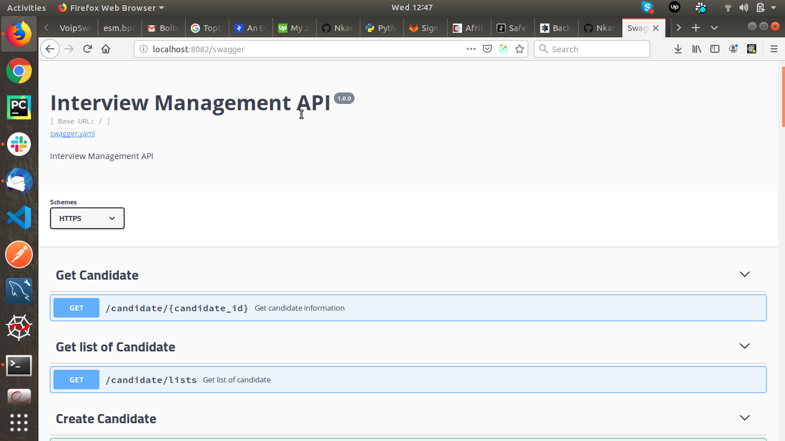

# Interview management

# Technology stack:

    - python 3.7,
    - Flask 1.0,
    - flake8 3.5.0,
    - docker 18.06.1-ce,
    - docker-compose 1.22.0,
    - swagger api documentation 2.0,
    - postgres 11.4,
    - Flask-Testing 2.1.1,
    - gunicorn 19.7.1,
    - Flask-SQLAlchemy 2.3.2,
    - coverage 4.4.2.

# To build and run the project:

    - docker-compose -f docker-compose-dev.yml build

# Run unit Test and code coverage:

    - docker-compose -f docker-compose-dev.yml run interview python manage.py cov

# Run code linting with flake8:

    - docker-compose -f docker-compose-dev.yml run interview flake8 project

# Run project:

    - docker-compose -f docker-compose-dev.yml up

# Test if service is up and runing:

    - http://localhost:5001/interview/ping
    
    Format: 

# Api documentation:

    - http://localhost:8082/swagger
    
